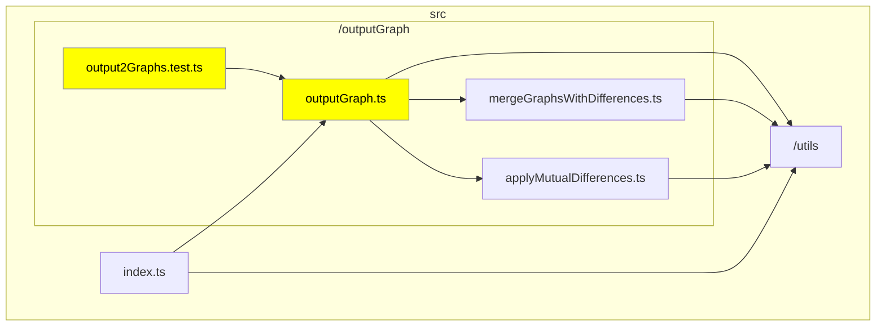
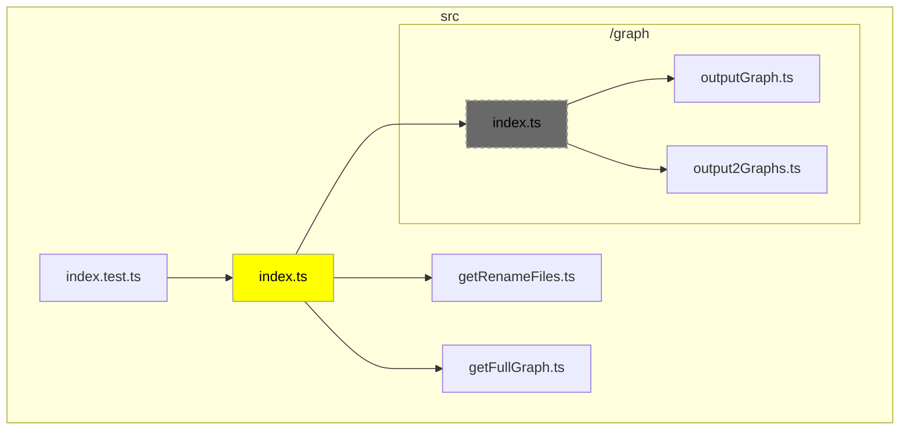
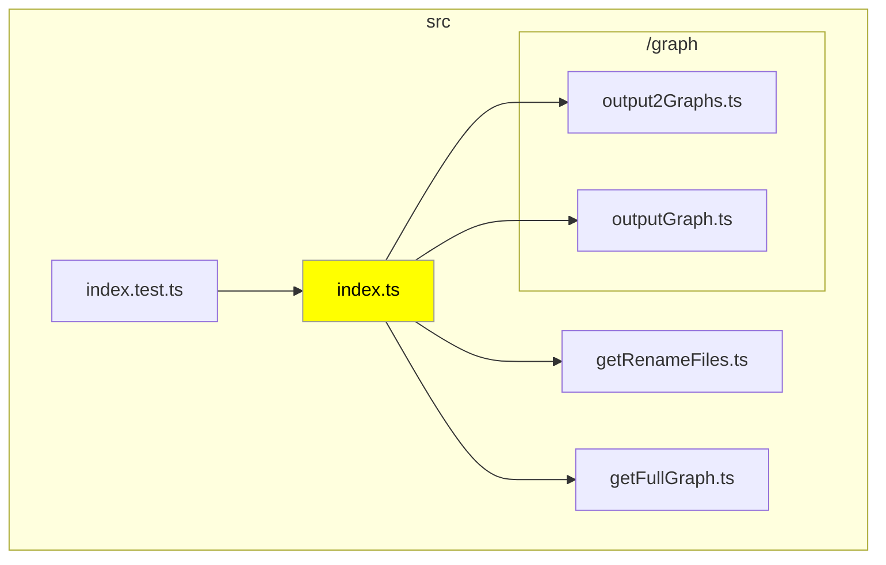

# danger-plugin-typescript-graph

<p align="center">
  <a href="/docs/README_ja.md">日本語 (Japanese)</a> 
</p>

[](https://badge.fury.io/js/danger-plugin-typescript-graph)
[](https://github.com/semantic-release/semantic-release)

This plugin is a Danger plugin designed to automatically run the CLI tool typescript-graph, which visualizes the dependencies between files in a TypeScript codebase, in a CI environment. Understanding dependencies is crucial for maintaining code integrity. By using this plugin, you can easily check dependencies before creating or merging a pull request.

## Usage

### Preparing to Run DangerJS on CI Environment

Before installing this library, make sure you have DangerJS set up to run on your CI environment. The setup involves the following 5 steps:

1. Include the Danger module.
2. Create a `Dangerfile` and add some basic rules.
3. Create an account for Danger to use.
4. Set up an access token for that account.
5. Configure your CI environment to run Danger.

For more details, please refer to the [DangerJS Official Getting Started Guide](https://danger.systems/js/guides/getting_started).

### Install

```sh
yarn add danger-plugin-typescript-graph --dev
```

### At a glance

```js
// dangerfile.js
import typescriptGraph from 'danger-plugin-typescript-graph';

typescriptGraph();
```

### Sample Usage

#### Basic File Modifications

In this example, we show the dependency graph when you've modified `outputGraph.ts` and its related test files. The modified files are highlighted in yellow, and the files they depend on are also explicitly displayed on the graph.



#### Changes Involving File Deletion or Movement

This case demonstrates the impact when a file is deleted or moved. Dependency graphs are generated for both the base branch and the head branch. Deleted files are displayed in a grayed-out manner.

##### Base Branch



##### Head Branch



## Configuration

The `.danger-tsgrc.json` is a configuration file that stores settings in JSON format. If the relevant configuration file does not exist, or if it is in an invalid format, the default settings will be applied.
Each configuration item has a corresponding environment variable, which takes precedence over the settings in the configuration file.

| Configuration Item                | Details                                                                           | Type         | Default Value | Description                                                                                                               |
| --------------------------------- | --------------------------------------------------------------------------------- | ------------ | ------------- | ------------------------------------------------------------------------------------------------------------------------- |
| Root directory for tsconfig       | Env: `TSG_TSCONFIG_ROOT`<br>Key: `tsconfigRoot`                                   | `string`     | `"./"`        | Specifies the directory where tsconfig will be searched.                                                                  |
| Maximum Node Count                | Env: `TSG_MAX_SIZE`<br>Key: `maxSize`                                             | `number`     | `30`          | Specifies the value to limit graph display when the number of changed files is large.                                     |
| Graph Orientation                 | Env: `TSG_ORIENTATION`<br>Key: `orientation`                                      | `TB` or `LR` | Not specified | Specifies the orientation (`TB` or `LR`) of the graph. However, Mermaid may produce graphs in the opposite direction.     |
| Debug Mode                        | Env: `TSG_DEBUG`<br>Key: `debug`                                                  | `boolean`    | `false`       | Specifies whether to enable debug mode. Logs will be output in debug mode.                                                |
| Enclose in `<details>` tag        | Env: `TSG_IN_DETAILS`<br>Key: `inDetails`                                         | `boolean`    | `true`        | Specifies whether to enclose Mermaid in a `<details>` tag and collapse it.                                                |
| Exclude Files                     | Env: None<br>Key: `exclude`                                                       | `string[]`   | `[]`          | Specifies the files to be excluded from the graph.                                                                        |
| Display index.ts Dependency Files | Env: `TSG_INCLUDE_INDEX_FILE_DEPENDENCIES`<br>Key: `includeIndexFileDependencies` | `boolean`    | `false`       | Specifies whether to display dependency files when the changed file is referenced from an index.ts in the same directory. |

## Changelog

See the GitHub [release history](https://github.com/ysk8hori/danger-plugin-typescript-graph/releases).

## Contributing

See [CONTRIBUTING.md](CONTRIBUTING.md).
