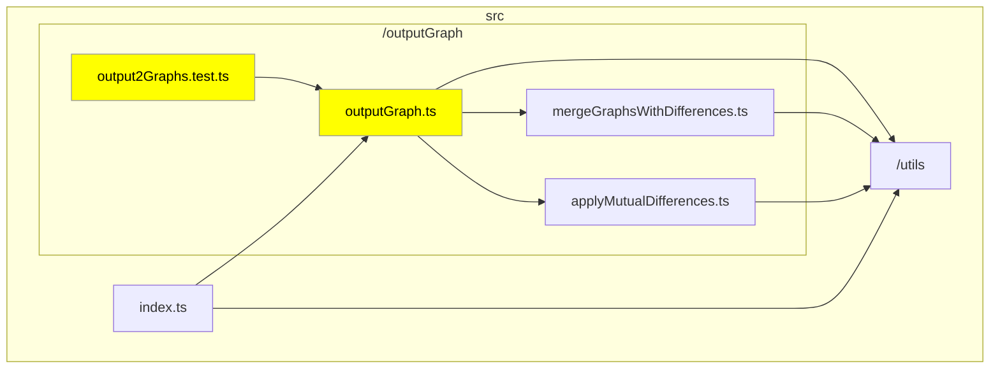
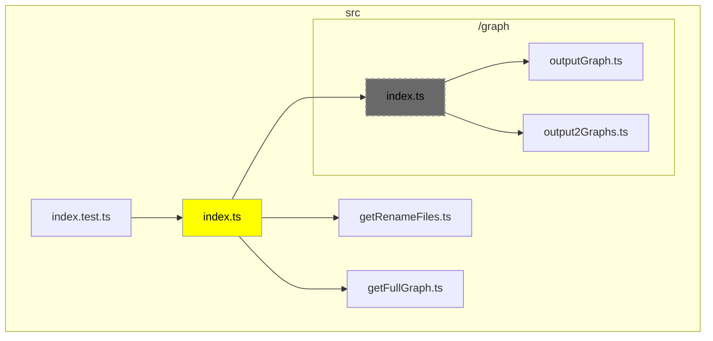
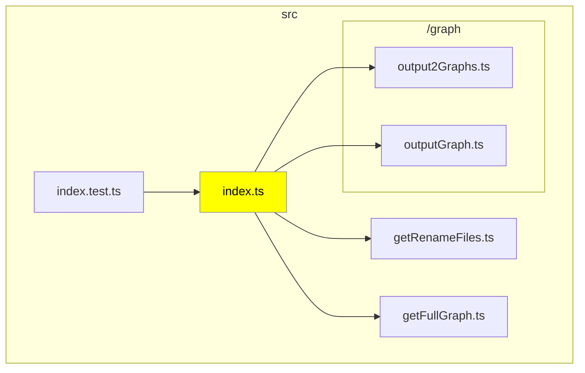

# danger-plugin-typescript-graph

<p align="center">
  <a href="../README.md">English</a> 
</p>

[](https://badge.fury.io/js/danger-plugin-typescript-graph)
[](https://github.com/semantic-release/semantic-release)

このプラグインは、TypeScript のコードベース内のファイル間の依存関係を視覚化する CLI ツール typescript-graph を、CI 環境で自動的に実行するための Danger プラグインです。
コードの健全性を維持する上で、依存関係を理解することは非常に重要です。このプラグインを使用することで、プルリクエストを作成またはマージする前に依存関係を簡単にチェックできます。

## Usage

### インストール

```sh
yarn add danger-plugin-typescript-graph --dev
```

### 使用方法

```js
// dangerfile.js
import typescriptGraph from 'danger-plugin-typescript-graph';

typescriptGraph();
```

### 動作サンプル

#### 基本的なファイル変更

この例では、outputGraph.ts と関連するテストファイルを修正した場合の依存関係グラフを示します。変更されたファイルは黄色でハイライトされ、依存関係にあるファイルもグラフ上で明示されています。



#### ファイルの削除または移動を含む変更

このケースでは、ファイルが削除または移動された場合の影響を示しています。base branch と head branch でそれぞれ依存関係グラフが生成されます。削除されたファイルはグレーアウトで表示されます。

##### Base Branch



##### Head Branch



## 設定

`.danger-tsgrc.json`は設定情報を JSON 形式で格納する設定ファイルです。該当する設定ファイルが存在しない、または不正な形式である場合、デフォルト設定が適用されます。
各設定項目には対応する環境変数が存在し、環境変数が設定ファイルより優先されます。

| 設定項目                      | 詳細                                                                              | 型           | デフォルト値 | 説明                                                                                                                                                                                                                                                                           |
| ----------------------------- | --------------------------------------------------------------------------------- | ------------ | ------------ | ------------------------------------------------------------------------------------------------------------------------------------------------------------------------------------------------------------------------------------------------------------------------------ |
| tsconfig のルートディレクトリ | Env: `TSG_TSCONFIG_ROOT`<br>Key: `tsconfigRoot`                                   | `string`     | `"./"`       | tsconfig を探索するディレクトリ情報を指定します。                                                                                                                                                                                                                              |
| 最大ノード数                  | Env: `TSG_MAX_SIZE`<br>Key: `maxSize`                                             | `number`     | `30`         | 変更ファイル数が多い場合にグラフの表示を抑止する値を指定します。                                                                                                                                                                                                               |
| グラフの方向                  | Env: `TSG_ORIENTATION`<br>Key: `orientation`                                      | `TB` or `LR` | 指定なし     | グラフの方向（`TB`または`LR`）を指定します。ただし、Mermaid は指定された方向と逆向きのグラフを出力する場合があります。                                                                                                                                                         |
| デバッグモード                | Env: `TSG_DEBUG`<br>Key: `debug`                                                  | `boolean`    | `false`      | デバッグモードを有効にするか指定します。デバッグモードではログを出力します。                                                                                                                                                                                                   |
| `<details>`タグで囲む         | Env: `TSG_IN_DETAILS`<br>Key: `inDetails`                                         | `boolean`    | `true`       | Mermaid を `<details>` タグで囲み折りたたむかどうかを指定します。                                                                                                                                                                                                              |
| ファイルの除外対象            | Env: なし<br>Key: `exclude`                                                       | `string[]`   | `[]`         | グラフから除外するファイルを指定します。ファイルやディレクトリのパスが指定された文字列に部分一致する場合、それらのファイルやディレクトリを依存関係グラフから除外します。ただし、指定されたファイルが変更対象となった場合、そのファイルは除外されず依存関係グラフに含まれます。 |
| index.ts 依存ファイルを表示   | Env: `TSG_INCLUDE_INDEX_FILE_DEPENDENCIES`<br>Key: `includeIndexFileDependencies` | `boolean`    | `false`      | 変更対象のファイルが同階層の index.ts から参照されている場合、その依存ファイルも表示するかどうかを指定します。                                                                                                                                                                 |

## Changelog

See the GitHub [release history](https://github.com/ysk8hori/danger-plugin-typescript-graph/releases).

## Contributing

See [CONTRIBUTING.md](CONTRIBUTING.md).
